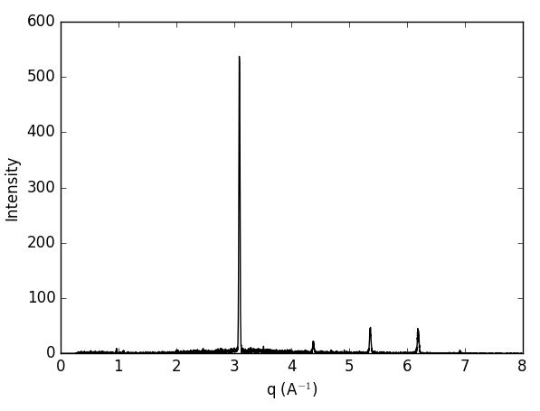
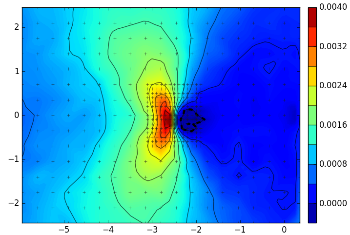

pyXe: X-ray Diffraction Strain Analysis Package
===============================================

[](https://zenodo.org/badge/latestdoi/20396/casimp/pyxe) 
[](https://travis-ci.org/casimp/pyxe) 
[](https://ci.appveyor.com/project/casimp/pyxe)
[](https://coveralls.io/github/casimp/pyxe?branch=master)

What is pyXe?
-------------

pyXe is a package developed to address bottlenecks in the diffraction-strain analysis workflow. It is vital that X-ray diffraction data acquired during synchrotron beamtimes is analysed in as close to real time as is possible. This allows for a tight feedback loop and ensures that decisions regarding acquisition and experimental parameters are optimized.

The pyXe package therefore aims to allow for the efficient analysis and visualization of diffraction data acquired from these large scale facilities. It achieves this through the extraction of strain from individual peaks (i.e. not a Reitveld type refinement). Peak fitting routines can be run over 1D, 2D and 3D data sets. Peaks and strain are extracted as a function of azimuthal position (either detector position or caking angle). The resultant strain data is then further interrogated to facilitate the calculation of principal and shear strains. Analysed data is stored in the hdf5 file format and can be easily reloaded and visualised.

This package was originally designed to work with energy dispersive X-ray diffraction data (EDXRD) stored in the NeXus format acquired on the I12:JEEP beamline at the Diamond Light Source, UK. However, it now supports calculation of strain from both energy dispersive and monochromatic (area detector) experiments. 

Example Usage
-------------

If we want to analyze data from an energy dispersive detector we need to import the energy_dispersive module and the associated detector class (EDI12 in the case of the 23-element detector array found on the I12:JEEP beamline). In this case the data was split into two files - coarse and fine scans - these can be merged using the ordered_merge function:

```python
>> from pyxe.energy_dispersive import EDI12
>> from pyxe.merge import ordered merge
```

The data from I12 is supplied in the NeXus format - we just need to specify the filepaths. In addition to coarse and fine scans there was an associated far field stress free d0 reading, which can be applied to the scans to allow us to accurately calculate the strain.

```python
>> i12_fine = EDI12(fpath='data/50414.nxs')
>> i12_coarse = EDI12(fpath='data/50418.nxs')
>> i12_d0 = EDI12(fpath='data/50402.nxs')
```

Before going any further it is often useful to vizualise one of the recorded diffraction patterns:

```python
>> coarse.plot_intensity()
```


To calculate the peak position we must specify an approximate value of q0 (in this case the material is Fe and the associated (111) peak is located at q=3.1). We must also specify a window within which to search for the peak. A larger window is better as long as it doesn't impinge upon other peaks:
```python
>> i12_coarse.fit_peaks(3.1, 0.25)
>> i12_fine.fit_peaks(3.1, 0.25)
>> i12_d0.fit_peaks(3.1, 0.25)
...
Progress: [####################] 100%
Total points: 6555 (23 az_angles x 285 positions)
Peak not found in 0 position/detector combintions
Error limit exceeded (or pcov not estimated) 12 times
```

To then convert these peaks into strain we simply apply the d0 readings to each analyzed dataset. Unless specified otherwise this function also attempts to calculate the full strain tensor via a full ring fit. This is often smooths the data and allows for the calculation of strain at arbitrary angles/shear strain determination.

```python
>> fine.calculate_strain(i12_q0)
>> coarse.calculate_strain(i12_q0)
```

Before plotting the strain map/profile we need to merge the coarse and fine data (although this can be done at any point!). We want to remove overlapping data, with the data points from the fine scan taking priority. Removing overlapping data often improves the final merged data set, although if no priority order is supplied then all data is kept.

```python
>> merged = ordered_merge([coarse, fine], [1, 0])
```

We can now plot a strain map. To do this we call the plot_slice method, stating which type of data we want to plot (e.g. peaks, fwhm, strain, stress, shear strain). We also need to supply either an azimuthal angle (phi) or a specific azimuthal slice index. In this case the slice index corresponds to the element of the 23-detector array.

```python
>> merged.plot_slice('strain', phi=np.pi/2)
```


Requirements
------------

PyXe is built on Python’s scientific stack (numpy, scipy, matplotlib). Additionally, the h5py package is required for the manipulation and management of the NeXus data files. Testing and development were carried out using the Anaconda (v 2019.03) package manager, which built with the following versions:

-	Python: version 3.7.3
-	numpy: version 1.16.2
-	scipy: version 1.2.1
-	matplotlib: version 3.0.3
-	h5py: version 2.8.0

Backward compatability to Python 3.5 is likely but not guaranteed. Monochromatic XRD caking/azimuthal integration within pyXe relies on pyFAI (and fabIO), which is a software package developed at the ESRF, designed to reduce SAXS, WAXS and XRPD images recorded by area detectors to 1D plots or 2D patterns. This caking functionality is not currently under development within pyXe and recent developments within pyFAI may have broken this functionality. While this may be fixed in the future we currently advise that azimuthal integration be carried out as a pre-processing step at the beamline (using pyFAI at ESRF or DAWN at DLS); the pyXe monochromatic post-processing analysis platform should be flexible enough to deal with most data inputs (although interface modules will likely be required outside of the Diamond Light Source).

Installation
------------

Install from the distribution using the setup.py script. The source is stored in the GitHub repo, which can be browsed at:

https://github.com/casimp/pyxe

Simply download and unpack, then navigate to the download directory and run the following from the command-line:

```
pip install .
```