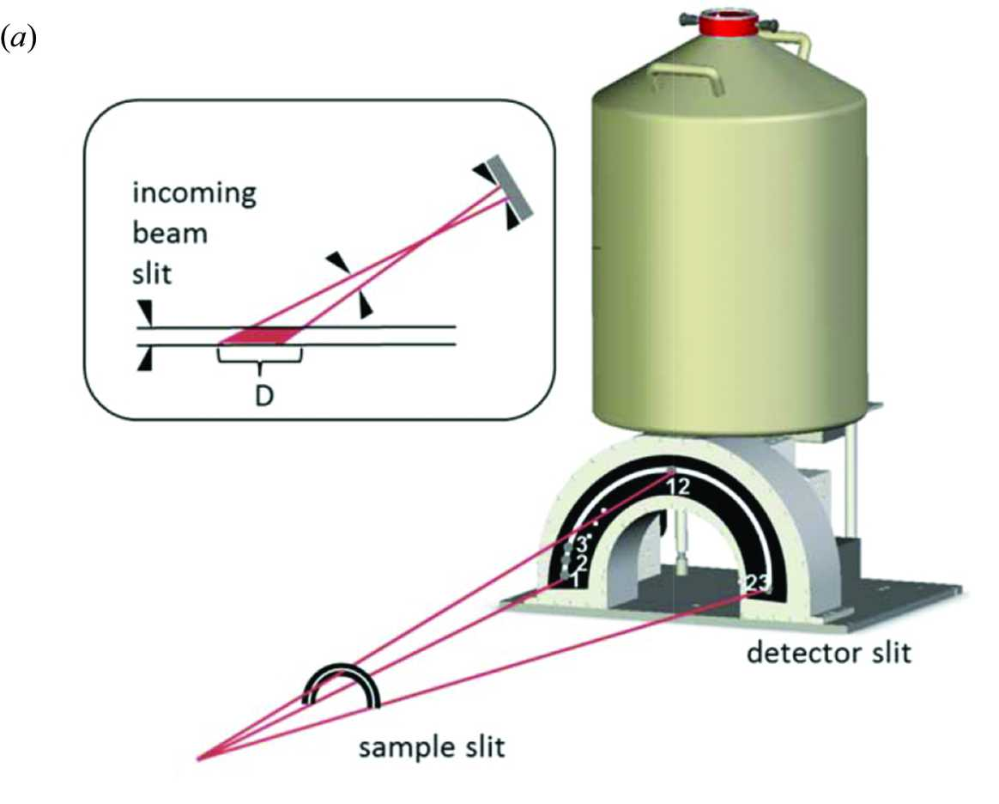

Background
==========

I12 and EDXD
------------

*Beamline I12-JEEP (Joint Engineering, Environmental, and Processing) is a high energy X-ray beamline for imaging, diffraction and scattering, which operates at energies of 53-150 keV.*

The I12-JEEP beamline is located at the Diamond Light Source (DLS) in Oxfordshire, UK. Specifications for the beamline have be detailed in the Journal of Synchrontron Radiation (:ref:`1`). Much of this information is replicated on the DLS's website:

http://www.diamond.ac.uk/Beamlines/Engineering-and-Environment/I12.html

The I12-JEEP beamline can be accessed through two separate experimental hutches. Experimental Hutch 2 (EH2), which is the larger of the hutches, contains the energy dispersive X-ray detector (EDXD). The layout of the detector can be seen below:

*The EDXD system. (a) Geometry of the detector, detector slits and sample slits showing the semi-annular arrangement of 23 independent Ge crystals (:ref:`1`).*

..

The detector is comprised of 23 elements spaced in steps of 8.2°, covering an azimuthal range from 0 to 180°. An additional, unused, detector is available in the case that one detector should fail. The data array that is output contains reference to this detector but it is ignored during the analysis. Detailed information about the EDXD setup can be found in the previously noted journal article and on the DLS website:

http://www.diamond.ac.uk/Beamlines/Engineering-and-Environment/I12/detectors/EDXD.html

Strain Calculation
------------------

Strain is calculated from each specified peak individually (i.e. this is not a Reitveld type refinement) although the strain from many individual peaks may be calculated and stored.
Strain is calculated against the unstrained inter-planar spacing, :math:`d_0`, such that:

.. math::
    \epsilon = \frac{d_n - d_0}{d_0}

or, more specifically, in terms of the scattering vector, q:

.. math::
    \epsilon = \frac{q_0}{q_n - q_0}.

The unstrained lattice parameter (:math:`d_0`) much either be explicity given or specified via a NeXus file containing EDXD measurements from an unstrained source.
A consideration of the methods by which to extract unstrained lattice parameters can be found in work by Withers et al. (:ref:`2`).

Principal and Shear Strains
~~~~~~~~~~~~~~~~~~~~~~~~~~~

The detector, and therefore angle, specific strain values can be further utilised to fit and extract a full description of the in-plane strain state.
This is beneficial due to the additional information that is then available, notably the principal in-plane strains and shear strain.
Further to this, these parameters allow for the extraction of strain at any defined angle.
This can be more accurate than the equivalent detector specific strain due to the additional information that is effectively leveraged in the calculations.

Plane-strain stress calculations
~~~~~~~~~~~~~~~~~~~~~~~~~~~~~~~~

In a system in which material along one axis is under constraint and the strain can be approximated to zero, the full strain trensor collapses down to the 2D in-plane state.
This then allows for the convenient calculation of stress. It must be emphasised that this is only a valid calculation in material under plane strain conditions.

References
----------

.. _1:

.. _2:
