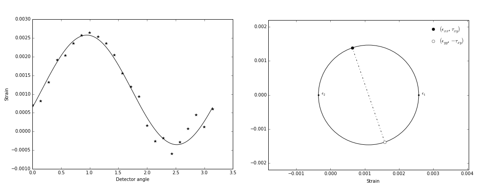

Background
==========

The following section provides a broad and basic overview of the key information and concepts used in the construction of the pyXe package. These details are by no means comprehensive. A comprehensive introduction to the topic can be found in the Synchrotron X-ray Diffraction (P. J. Withers) chapter of Practical Residual Stress Measurements by G. S. Shajer [1].

Strain Calculation
------------------

In pyXe, strain can now be calculated either from either a single user defined peak and associated lattice spacing, :math:`d`, or through a multi-peak Pawley type refinement and the associated lattice parameter, :math:`a`. Strain is calculated against an unstrained equivalent, :math:`d_0` or :math:`a_0`, respectively. For a single peak approach, strain is found according to the following relationship:

.. math::
    \epsilon = \frac{d_n - d_0}{d_0}

or, in terms of the scattering vector, q:

.. math::
    \epsilon = \frac{q_0}{q_n} - 1.

The unstrained lattice spacing (:math:`d_0`) much either be explicitly given or specified via an analysed pyXe file (i.e. containing unstrained peaks that had been fit using pyXe) containing measurements from an unstrained source.
A consideration of the methods by which to extract unstrained lattice parameters can be found in work by Withers et al [3]. Note that in almost all cases, it is preferable to pass in a list of unstrained lattice spacings/parameters with respect to detetor or angle. This typically removes much of the systematic error introduced via detector alignment and set-up.

In-plane Strain Tensor
---------------------------

The detector, and therefore angle, specific strain values can be further utilised to calculate the in-plane strain tensor. This reduces uncertainty relative to single detector/angle analysis and allows for the extraction of strain at any defined angle. 

*(a) An example of the fit made through the strain array corresponding to the 23-element detector array. (b) The corresponding Mohr's circle highlighting both the principal strain and the strain and shear strain at 0° and 90°.*

Stress Calculations
-------------------

In a 3D strain state, the normal stresses can be calculated according to the following equation:

.. math:: \sigma_{xx} = \frac{E}{(1 + \mu)(1 - 2\mu)} \left[(1 - \mu)\epsilon_{xx} + \mu(\epsilon_{yy} + \epsilon_{zz})\right].

In both monochromatic and energy dispersive diffraction we typically capture the peak shifts and therefore the strain in 2D (nominally in x and y). The peak shift and strain in the orientation along the beam are not measured. Stress cannot be calculated unless additional information is available. One situation in which it is possible to calculate stress is under a plane strain criterion. In this scenario material along one axis (in this case along the beam direction) is under constraint and the strain can be approximated to zero. Ignoring poisson ratio effects, the full strain tensor collapses down to the 2D in-plane state such that:

.. math::  \epsilon_{ij} =
  \begin{pmatrix}  \epsilon_{xx} & \epsilon_{xy} & \epsilon_{xz} \\
  \epsilon_{yx} & \epsilon_{yy} & \epsilon_{yz} \\
  \epsilon_{zx} & \epsilon_{zy} & \epsilon_{zz}
  \end{pmatrix} =
  \begin{pmatrix}  \epsilon_{xx} & \epsilon_{xy}\\
  \epsilon_{yx} & \epsilon_{yy}
  \end{pmatrix}.

This then allows for the convenient calculation of stress:

.. math:: \sigma_{xx} = \frac{E}{(1 + \mu)(1 - 2\mu)} \left[(1 - \mu)\epsilon_{xx} + \mu(\epsilon_{yy})\right]

A similar consideration and approach is available in pyXe for scenarios in which the stress state is more accurately characterised as plane stress. 

References
----------
1. Withers, P. (2013). Synchrotron X-ray Diffraction. In - Practical Residual Stress Measurement Methods (pp. 163–194).

2. Drakopoulos, M., Connolley, T., Reinhard, C., Atwood, R., Magdysyuk, O., Vo, N., … Wanelik, K. (2015). I12: the Joint Engineering , Environment and Processing ( JEEP ) beamline at Diamond Light Source. Journal of Synchrotron Radiation, (2015), 828–838. http://doi.org/10.1107/S1600577515003513

3. Withers, P. J., Preuss, M., Steuwer, a., & Pang, J. W. L. (2007). Methods for obtaining the strain-free lattice parameter when using diffraction to determine residual stress. Journal of Applied Crystallography, 40(5), 891–904. http://doi.org/10.1107/S0021889807030269
